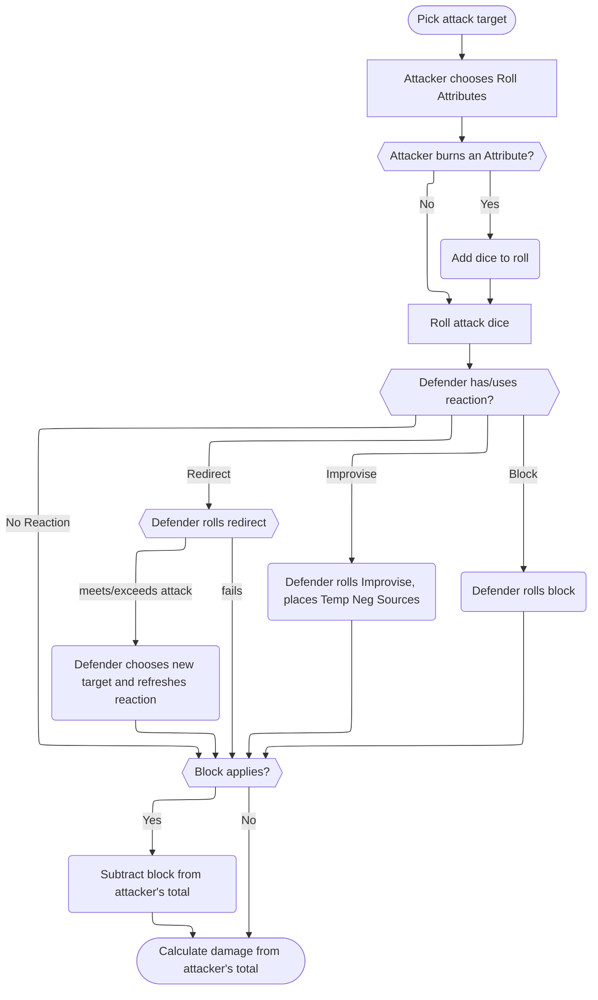

# Phys Combat Flowchart

```mermaid
---
config:
  theme: mc
  layout: elk
---
flowchart TD
  start(["Pick attack target"])
  attackdice["Attacker chooses Roll Attributes"]
  attackburn{{"Attacker burns an Attribute?"}}
  burnadd("Add dice to roll")
  attackroll["Roll attack dice"]
  react{{"Defender has/uses reaction?"}}
  redirect{{"Defender rolls redirect"}}
  redirectsucc("Defender chooses new target and refreshes reaction")
  improv("Defender rolls Improvise, places Temp Neg Sources")
  block("Defender rolls block")
  blockcond{{"Block applies?"}}
  blocksub("Subtract block from attacker's total")
  damage(["Calculate damage from attacker's total"])
  
  start-->attackdice-->attackburn
  attackburn -- Yes --> burnadd --> attackroll
  attackburn -- No --> attackroll
  attackroll --> react
  react -- Redirect --> redirect
  redirect -- meets/exceeds attack --> redirectsucc --> blockcond
  redirect -- fails --> blockcond
  react -- Block --> block --> blockcond
  blockcond -- Yes --> blocksub
  blockcond -- No --> damage
  react -- Improvise --> improv
  improv --> blockcond
  react -- No Reaction --> blockcond
  blocksub --> damage
  
```
